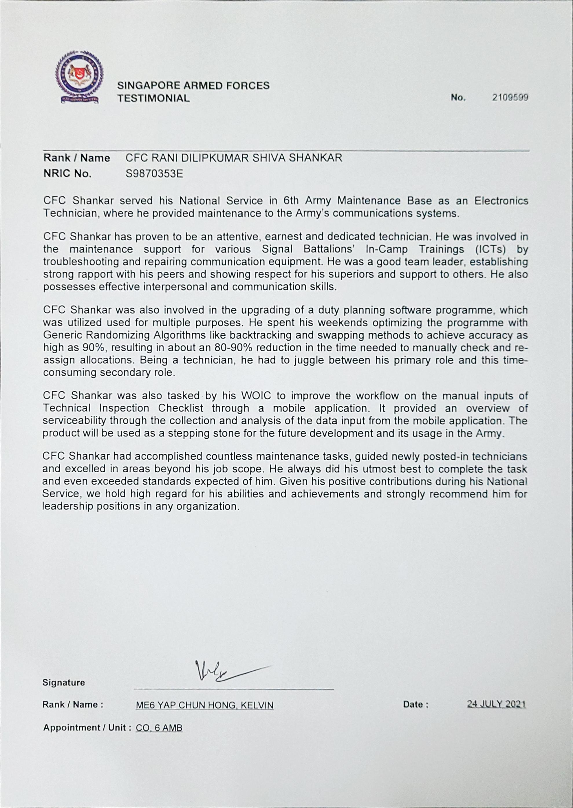

# TIChecklist ✅

## Project's Aim
1) To simplify the task of collecting data from the vehicles.
2) To synchronise the data, thus mitigating misinformation.
3) Easier to analyse data.

---

## Architecture

---
## Project Management (Targetted to complete by July 2021)

### UX - 23 May 2021

| Task                      | Completed by | Assigned to   | Current Status | Finished |
| ------------------------- | ------------ | ------------- | -------------- | -------- |
| Forms Design              | 23  May      | @shankar-shiv |                | ✅        |
| Card Design in homeScreen | 23  May      | @shankar-shiv |                | ✅        |
| Login Screen              | 23 May       | @shankar-shiv |                | ✅        |
| Charts                    | 25 May       | @shankar-shiv |                | ✅        |
| Undo functionality        | 31 May       | @shankar-shiv |                | ✅        |

### Navigation and Routing

| Task                           | Time required | Assigned to   | Current Status | Finished |
| ------------------------------ | ------------- | ------------- | -------------- | -------- |
| Routing different forms        | 25 May        | @shankar-shiv |                | ✅        |
| Routing from login to homepage | 25 May        | @shankar-shiv |                | ✅        |

### Data manipulation and Backend processes

| Task                            | Time required | Assigned to   | Current Status | Finished |
| ------------------------------- | ------------- | ------------- | -------------- | -------- |
| Capturing data from forms       | 31 May        | @shankar-shiv |                | ✅        |
| Saving JSON files to disk       | 31 May        | @shankar-shiv |                | ✅        |
| Retrieving JSON files from disk | 31 May        | @shankar-shiv |                | ✅        |

---

## Note of thanks

This project was successfully completed in the course of 3 months and submitted to ME3 Ng Chee Tong.
- I thank ME3 Ng Chee Tong for providing me a woderful opportunity to work in this project.
- I also would like to thank 3SG Prem Yadunand @yadunut for his support and guidance. 
- I would not have completed the project successfully without their support.
- I am truly grateful for their support. 
Thank You to all of my dear friends and superiors for your encouragement and motivation.

## Certificate of Achievement

