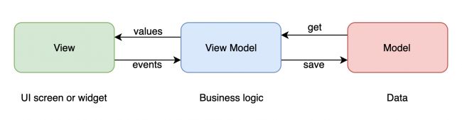

# TIChecklist ✅

## Project's Aim
1) To simplify the task of collecting data from the vehicles
2) To synchronise the data, thus mitigating misinformation

### User Interface
---

#### Login Screen (tentatively, for now we keep it simple, use splash screen)
#### Home Screen
The home screen contains 3 Tabs: 
1. List of checklists
2. Charts about the checklists 
3. Settings

#### Charts Screen (Summary about all the checklists)

#### Settings Screen

#### Add Checklist

#### Checklist Details Screen

#### Edit Checklist Details Screen

#### Filter Checklists 

---
## Data Sources

There are three levels of data persistence:

  - In-memory cache - Fast
  - Disk (HiveDB) - Fast
  
Synchronization between layers is hard and depends on the case so it's out of the scope for the samples. The chosen sync implementation is very simple:

  - In every get operation:
    - Return in-memory cache if available, or
    - return info from disk 
  - Every write/delete operation will simply:
    - Update cache
    - Update local

## Routing

  - App must have 2 named routes: 
    - `/` - Takes you to the home tabs screen
    - `/addChecklist` - Takes you to the add checklist screen
    
To get to the Details and Edit screens, you can either use a named route or push a new Route directly with the Navigator.

## Project Management (Targetted to complete by 31 May)

### UX - 23 May 2021

| Task                    | Completed by | Assigned to   | Current Status | Finished |
| ----------------------- | ------------ | ------------- | -------------- | -------- |
| Forms Design            | 23  May      | @shankar-shiv | just started   | ❌        |
| Card Design in homepage | 23  May      | @shankar-shiv |                | ❌        |
| Login Screen            | 23 May       | @yadunut      |                | ❌        |
| Charts                  | 25 May       | @shankar-shiv |                | ❌        |
| Undo functionality      | 31 May       | @shankar-shiv |                | ❌        |

### Navigation and Routing

| Task                           | Time required | Assigned to | Current Status | Finished |
| ------------------------------ | ------------- | ----------- | -------------- | -------- |
| Routing different forms        | 25 May        | @yadunut    |                | ❌        |
| Routing from login to homepage | 25 May        | @yadunut    |                | ❌        |

### Data and Backend
| Task                       | Time required | Assigned to | Current Status | Finished |
| -------------------------- | ------------- | ----------- | -------------- | -------- |
| Capturing data from forms  | 31 May        | @shankar    |                | ❌        |
| Saving JSON files to disk  | 31 May        | @yadunut    |                | ❌        |
| Retrieving files from disk | 31 May        | @yadunut    |                | ❌        |
| Final data in excel view   | 31 May        | @shankar    |                | ❌        |

## Packages used
1. [Hive DB](https://pub.dev/packages/hive)
2. (Shared Preferences)[https://stackoverflow.com/questions/52831605/flutter-shared-preferences/54031842#54031842] 

## State management, MVVM(Model, View, ViewModel) Architecture reference
1. [Official Flutter Provider shopper](https://github.com/flutter/samples/tree/master/provider_shopper)
2. [Official Flutter Provider Counter](https://github.com/flutter/samples/tree/master/provider_counter)
3. [Flutter tutorial: Architect your app using Provider and Stream](https://blog.codemagic.io/flutter-tutorial-app-arhitecture-beginners/)
4. [Filled Stacks](https://www.filledstacks.com/post/flutter-architecture-my-provider-implementation-guide/)
5. [Currency app; good reference](https://www.raywenderlich.com/6373413-state-management-with-provider#toc-anchor-003)
6. 

## Login page UI

1. [Flutter login animation](https://github.com/GeekyAnts/flutter-login-home-animation)

## Main Page User Interface (UI) 👨‍🎨

1. [Bottom Navigation bar](https://github.com/pedromassango/bottom_navy_bar)
2. 

## Form design 

1. [Timeline for easy viewing](https://github.com/JHBitencourt/timeline_tile) 🤔
2. [Slideable for Update and Delete](https://github.com/JHBitencourt/timeline_tile)

### Inspirational ideas 💡
1. [Awesome Flutter](https://github.com/Solido/awesome-flutter)

## MVVM
For communication between the UI and the business logic, the architecture is similar to MVVM (Model View ViewModel).

The model is the data from a source like a database or the web. The view is the UI, like a screen or widget. The view model is the business logic sitting between the UI and the data. It provides data in a form that the UI can present, but it knows nothing about the UI itself. This differs from the MVP architecture. The view model also doesn’t know where the data comes from. That’s abstracted away.

Each screen will have its own view model.

